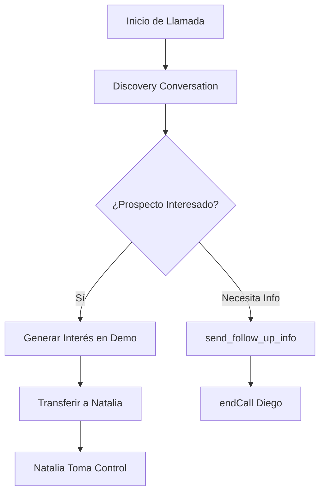
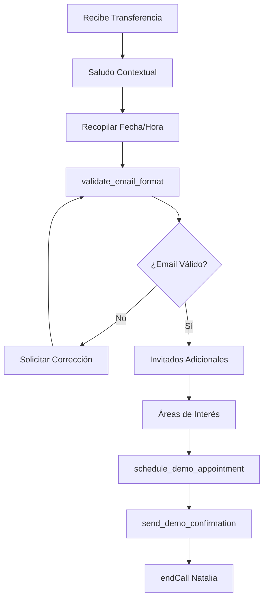

# DOCUMENTACIÓN TÉCNICA - HERRAMIENTAS Y FUNCIONES PERSONALIZADAS
## Sistema de Tools y Webhooks para Agentes VAPI

---

## 📋 ÍNDICE

1. [Resumen de Herramientas](#resumen-de-herramientas)
2. [Herramientas de Diego](#herramientas-de-diego)
3. [Herramientas de Natalia](#herramientas-de-natalia)
4. [Webhooks y Endpoints](#webhooks-y-endpoints)
5. [Esquemas de Datos](#esquemas-de-datos)
6. [Flujo de Ejecución](#flujo-de-ejecución)
7. [Manejo de Errores](#manejo-de-errores)

---

##  RESUMEN DE HERRAMIENTAS

### Arquitectura de Tools
El sistema utiliza **herramientas personalizadas** (custom tools) que se ejecutan durante las conversaciones de los agentes virtuales. Estas herramientas se comunican con webhooks externos para realizar acciones específicas como:

- Envío de información de seguimiento
- Validación de emails
- Agendamiento de demos
- Finalización de llamadas
- Transferencia entre agentes

### Servidor de Herramientas
```
Base URL: https://workflows.cleverideas.com.mx/webhook/
```

### Tipos de Herramientas
1. **Funciones Asíncronas**: Ejecutan acciones y pueden mostrar mensajes mientras procesan
2. **Funciones Síncronas**: Validaciones rápidas que retornan inmediatamente
3. **Herramientas de Control**: endCall, transferCall para manejo de flujo

---

##  HERRAMIENTAS DE DIEGO

Diego cuenta con **2 herramientas principales** para el proceso de discovery y generación de interés:

### 1. send_follow_up_info

#### Configuración
```json
{
  "type": "function",
  "async": true,
  "messages": [],
  "function": {
    "name": "send_follow_up_info",
    "description": "Envía información de seguimiento al prospecto por email y SMS",
    "parameters": {
      "type": "object",
      "properties": {
        "prospect_name": {
          "type": "string",
          "description": "Nombre completo del prospecto"
        },
        "company": {
          "type": "string", 
          "description": "Nombre de la empresa"
        },
        "email": {
          "type": "string",
          "description": "Email del prospecto"
        },
        "phone": {
          "type": "string",
          "description": "Teléfono del prospecto"
        },
        "interest_areas": {
          "type": "array",
          "items": {
            "type": "string"
          },
          "description": "Áreas de interés específicas del prospecto"
        },
        "call_summary": {
          "type": "string",
          "description": "Resumen de la conversación"
        }
      },
      "required": ["prospect_name", "company", "email", "phone", "interest_areas", "call_summary"]
    }
  },
  "server": {
    "url": "https://workflows.cleverideas.com.mx/webhook/agent-web-tools"
  }
}
```

#### Propósito
- **Cuándo se usa**: Cuando el prospecto solicita información adicional o necesita seguimiento
- **Qué hace**: Envía email personalizado con información de soluciones de IA y SMS de seguimiento
- **Datos enviados**: Información completa del prospecto y resumen de necesidades identificadas

#### Ejemplo de Uso
```javascript
// Diego detecta interés pero el prospecto necesita información
"El prospecto Juan Pérez de TechCorp mostró interés en automatización de servicio al cliente. 
Solicitó información adicional sobre costos y implementación."

// Tool se ejecuta con:
{
  "prospect_name": "Juan Pérez",
  "company": "TechCorp",
  "email": "juan.perez@techcorp.com",
  "phone": "+525551234567",
  "interest_areas": ["Servicio al Cliente", "Automatización", "WhatsApp Business"],
  "call_summary": "Prospecto interesado en automatizar servicio al cliente. Empresa mediana con 50+ empleados. Principales dolores: atención fuera de horario y volumen alto de consultas. Solicitó información sobre costos y tiempos de implementación."
}
```

### 2. endCall (Diego)

#### Configuración
```json
{
  "type": "endCall",
  "messages": [
    {
      "type": "request-start",
      "contents": [
        {
          "type": "text",
          "text": "Perfecto, {{ $json.name.split(' ')[0] || ('') }}, nos vemos muy pronto en la demo. ¡Vas a quedar impresionado con lo que podemos hacer por tu empresa!",
          "language": "es"
        }
      ]
    }
  ]
}
```

#### Propósito
- **Cuándo se usa**: Al finalizar exitosamente el discovery y generar interés hacia la demo
- **Qué hace**: Termina la llamada con mensaje personalizado y optimista
- **Transición**: Indica que el prospecto será contactado por Natalia para agendar

---

##  HERRAMIENTAS DE NATALIA

Natalia cuenta con **4 herramientas especializadas** para el agendamiento de demos:

### 1. schedule_demo_appointment

#### Configuración
```json
{
  "type": "function",
  "async": true,
  "messages": [],
  "function": {
    "name": "schedule_demo_appointment",
    "description": "Agenda la demo personalizada con toda la información recopilada",
    "parameters": {
      "type": "object",
      "properties": {
        "prospect_name": {
          "type": "string",
          "description": "Nombre completo del prospecto principal"
        },
        "company": {
          "type": "string",
          "description": "Nombre de la empresa"
        },
        "prospect_email": {
          "type": "string",
          "description": "Email del prospecto principal (validado)"
        },
        "prospect_phone": {
          "type": "string",
          "description": "Teléfono del prospecto"
        },
        "preferred_date": {
          "type": "string",
          "description": "Fecha preferida para la demo en formato YYYY-MM-DD"
        },
        "preferred_time": {
          "type": "string",
          "description": "Horario preferido (ej: diez de la mañana, dos y media de la tarde)"
        },
        "time_zone": {
          "type": "string",
          "description": "Zona horaria del prospecto"
        },
        "additional_attendees": {
          "type": "array",
          "items": {
            "type": "object",
            "properties": {
              "name": {"type": "string"},
              "email": {"type": "string"},
              "role": {"type": "string"}
            }
          },
          "description": "Personas adicionales que asistirán a la demo"
        },
        "interest_areas": {
          "type": "array",
          "items": {"type": "string"},
          "description": "Áreas específicas de interés para personalizar la demo"
        },
        "special_requirements": {
          "type": "string",
          "description": "Requerimientos especiales o notas adicionales"
        }
      },
      "required": ["prospect_name", "company", "prospect_email", "prospect_phone", "preferred_date", "preferred_time", "time_zone", "interest_areas"]
    }
  },
  "server": {
    "url": "https://workflows.cleverideas.com.mx/webhook/agent-web-tools"
  }
}
```

#### Ejemplo de Ejecución
```json
{
  "prospect_name": "María García",
  "company": "Innovación Digital SA",
  "prospect_email": "maria.garcia@innovaciondigital.com",
  "prospect_phone": "+525551234567",
  "preferred_date": "2025-01-25",
  "preferred_time": "dos de la tarde",
  "time_zone": "hora del centro",
  "additional_attendees": [
    {
      "name": "Carlos López",
      "email": "carlos.lopez@innovaciondigital.com", 
      "role": "Director de TI"
    }
  ],
  "interest_areas": ["Gestión de Citas", "Servicio al Cliente", "WhatsApp Business"],
  "special_requirements": "Necesitan demo enfocada en integración con su CRM actual"
}
```

### 2. validate_email_format

#### Configuración
```json
{
  "type": "function",
  "async": false,
  "messages": [],
  "function": {
    "name": "validate_email_format",
    "description": "Valida que el formato del email sea correcto",
    "parameters": {
      "type": "object",
      "properties": {
        "email": {
          "type": "string",
          "description": "Email a validar"
        }
      },
      "required": ["email"]
    }
  },
  "server": {
    "url": "https://workflows.cleverideas.com.mx/webhook/agent-web-tools"
  }
}
```

#### Propósito
- **Cuándo se usa**: Antes de confirmar el email del prospecto
- **Qué hace**: Valida formato y existencia del dominio
- **Retorna**: `true/false` para continuar o solicitar corrección

#### Ejemplo de Validación
```javascript
// Input válido
validate_email_format("maria.garcia@empresa.com") 
// Returns: {"valid": true, "message": "Email válido"}

// Input inválido
validate_email_format("email-incorrecto")
// Returns: {"valid": false, "message": "Formato de email inválido"}
```

### 3. send_demo_confirmation

#### Configuración
```json
{
  "type": "function",
  "async": true,
  "messages": [
    {
      "type": "request-start",
      "content": "Perfecto, {{ $json.name.split(' ')[0] || ('') }}, te voy a enviar toda la confirmación por email y también te llegará un SMS de recordatorio..."
    }
  ],
  "function": {
    "name": "send_demo_confirmation",
    "description": "Envía confirmación de la demo agendada por email y SMS",
    "parameters": {
      "type": "object",
      "properties": {
        "prospect_name": {
          "type": "string",
          "description": "Nombre del prospecto"
        },
        "prospect_email": {
          "type": "string",
          "description": "Email del prospecto"
        },
        "prospect_phone": {
          "type": "string",
          "description": "Teléfono del prospecto"
        },
        "demo_date": {
          "type": "string",
          "description": "Fecha de la demo"
        },
        "demo_time": {
          "type": "string",
          "description": "Hora de la demo"
        },
        "meeting_link": {
          "type": "string",
          "description": "Link de la reunión"
        }
      },
      "required": ["prospect_name", "prospect_email", "prospect_phone", "demo_date", "demo_time"]
    }
  },
  "server": {
    "url": "https://workflows.cleverideas.com.mx/webhook/agent-web-tools"
  }
}
```

#### Flujo de Confirmación
1. **Durante la ejecución**: Natalia informa que está enviando la confirmación
2. **Email enviado**: Confirmación detallada con calendario adjunto
3. **SMS enviado**: Recordatorio breve con fecha y hora
4. **Link generado**: URL única para la reunión virtual

### 4. endCall (Natalia)

#### Configuración
```json
{
  "type": "endCall",
  "messages": [
    {
      "type": "request-start",
      "contents": [
        {
          "type": "text",
          "text": "¡Perfecto! {{ $json.name.split(' ')[0] || ('') }} Ya tienes tu demo agendada. Te llegará toda la información por email y WhatsApp. ¡Nos vemos muy pronto!",
          "language": "es"
        }
      ]
    }
  ]
}
```

---

##  WEBHOOKS Y ENDPOINTS

### Endpoint Principal de Herramientas
```
URL: https://workflows.cleverideas.com.mx/webhook/agent-web-tools
Method: POST
Content-Type: application/json
```

### Endpoint de End-of-Call
```
URL: https://workflows.cleverideas.com.mx/webhook/web_agent_endcall  
Method: POST
Content-Type: application/json
```

### Estructura de Request
```json
{
  "tool_name": "send_follow_up_info",
  "parameters": {
    "prospect_name": "string",
    "company": "string",
    // ... otros parámetros según la herramienta
  },
  "call_context": {
    "call_id": "string",
    "agent_name": "Diego-Clever",
    "customer_number": "+525551234567",
    "timestamp": "2025-01-15T10:30:00Z"
  }
}
```

### Estructura de Response
```json
{
  "success": true,
  "message": "Información enviada exitosamente",
  "data": {
    "email_sent": true,
    "sms_sent": true,
    "confirmation_id": "CONF-2025-001"
  },
  "next_action": "continue_conversation"
}
```

---

##  ESQUEMAS DE DATOS

### Schema para send_follow_up_info
```json
{
  "$schema": "http://json-schema.org/draft-07/schema#",
  "type": "object",
  "properties": {
    "prospect_name": {
      "type": "string",
      "minLength": 2,
      "maxLength": 100
    },
    "company": {
      "type": "string", 
      "minLength": 2,
      "maxLength": 100
    },
    "email": {
      "type": "string",
      "format": "email"
    },
    "phone": {
      "type": "string",
      "pattern": "^\\+[1-9]\\d{1,14}$"
    },
    "interest_areas": {
      "type": "array",
      "items": {
        "type": "string",
        "enum": [
          "Gestión de Citas",
          "Ventas y Conversión", 
          "Cobranza Inteligente",
          "Servicio al Cliente",
          "WhatsApp Business",
          "Automatización",
          "uContact Platform"
        ]
      },
      "minItems": 1,
      "maxItems": 7
    },
    "call_summary": {
      "type": "string",
      "minLength": 50,
      "maxLength": 500
    }
  },
  "required": ["prospect_name", "company", "email", "phone", "interest_areas", "call_summary"]
}
```

### Schema para schedule_demo_appointment
```json
{
  "$schema": "http://json-schema.org/draft-07/schema#",
  "type": "object",
  "properties": {
    "prospect_name": {"type": "string", "minLength": 2, "maxLength": 100},
    "company": {"type": "string", "minLength": 2, "maxLength": 100},
    "prospect_email": {"type": "string", "format": "email"},
    "prospect_phone": {"type": "string", "pattern": "^\\+[1-9]\\d{1,14}$"},
    "preferred_date": {
      "type": "string",
      "pattern": "^\\d{4}-\\d{2}-\\d{2}$",
      "description": "Fecha en formato YYYY-MM-DD"
    },
    "preferred_time": {
      "type": "string",
      "description": "Hora en formato natural (ej: dos de la tarde)"
    },
    "time_zone": {
      "type": "string",
      "enum": ["hora del centro", "hora del pacífico", "hora del este", "hora de montaña"]
    },
    "additional_attendees": {
      "type": "array",
      "items": {
        "type": "object",
        "properties": {
          "name": {"type": "string"},
          "email": {"type": "string", "format": "email"},
          "role": {"type": "string"}
        },
        "required": ["name", "email", "role"]
      },
      "maxItems": 5
    },
    "interest_areas": {
      "type": "array",
      "items": {"type": "string"},
      "minItems": 1
    },
    "special_requirements": {
      "type": "string",
      "maxLength": 300
    }
  },
  "required": ["prospect_name", "company", "prospect_email", "prospect_phone", "preferred_date", "preferred_time", "time_zone", "interest_areas"]
}
```

---

## ⚡ FLUJO DE EJECUCIÓN

### Flujo de Diego


### Flujo de Natalia


### Timing de Herramientas
```javascript
// Herramientas síncronas (< 2 segundos)
validate_email_format: "~500ms"

// Herramientas asíncronas (2-10 segundos)
send_follow_up_info: "~3-5 segundos"
schedule_demo_appointment: "~2-4 segundos" 
send_demo_confirmation: "~3-6 segundos"
```

---

##  MANEJO DE ERRORES

### Tipos de Errores

#### 1. Errores de Validación
```json
{
  "success": false,
  "error_type": "validation_error",
  "message": "Email format is invalid",
  "field": "prospect_email",
  "provided_value": "invalid-email",
  "expected_format": "user@domain.com"
}
```

#### 2. Errores de Servicio
```json
{
  "success": false,
  "error_type": "service_error", 
  "message": "Unable to send email confirmation",
  "service": "email_service",
  "retry_possible": true,
  "retry_after": 30
}
```

#### 3. Errores de Datos
```json
{
  "success": false,
  "error_type": "data_error",
  "message": "Required field missing",
  "missing_fields": ["preferred_date", "time_zone"]
}
```

### Estrategias de Recuperación

#### Para Diego
```javascript
// Si send_follow_up_info falla
if (tool_error) {
    response = "Perfecto, me aseguraré de que recibas toda la información. " +
              "Mientras tanto, ¿te gustaría agendar una demo personalizada?";
    // Continúa hacia transferencia a Natalia
}
```

#### Para Natalia  
```javascript
// Si validate_email_format falla
if (email_validation_error) {
    response = "Parece que hay un pequeño problema con el email. " +
              "¿Podrías deletreármelo letra por letra para asegurarme?";
    // Solicita email nuevamente
}

// Si schedule_demo_appointment falla
if (scheduling_error) {
    response = "Déjame verificar la disponibilidad en nuestro sistema. " +
              "¿Tendrías alguna fecha alternativa por si acaso?";
    // Reintenta con datos alternativos
}
```

### Logs de Error
```json
{
  "timestamp": "2025-01-15T10:30:00Z",
  "call_id": "call-123456",
  "agent": "Natalia-Clever",
  "tool": "send_demo_confirmation",
  "error": {
    "type": "timeout_error",
    "message": "Email service timeout after 10 seconds",
    "stack_trace": "...",
    "request_data": {"prospect_email": "user@domain.com"}
  },
  "recovery_action": "retry_with_fallback",
  "customer_impact": "minimal"
}
```

---

##  MÉTRICAS Y MONITOREO

### Métricas por Herramienta
```json
{
  "send_follow_up_info": {
    "total_executions": 1250,
    "success_rate": 98.4,
    "avg_response_time": "3.2s",
    "email_delivery_rate": 99.1,
    "sms_delivery_rate": 97.8
  },
  "validate_email_format": {
    "total_executions": 3420,
    "success_rate": 99.9,
    "avg_response_time": "0.4s",
    "invalid_email_rate": 12.3
  },
  "schedule_demo_appointment": {
    "total_executions": 890,
    "success_rate": 96.7,
    "avg_response_time": "2.8s",
    "calendar_conflicts": 3.3
  },
  "send_demo_confirmation": {
    "total_executions": 856,
    "success_rate": 98.1,
    "avg_response_time": "4.1s",
    "email_open_rate": 87.2
  }
}
```

### Alertas Configuradas
```yaml
alerts:
  - name: "High Error Rate"
    condition: "error_rate > 5%"
    notification: "slack_webhook"
    
  - name: "Slow Response Time"  
    condition: "avg_response_time > 10s"
    notification: "email_alert"
    
  - name: "Email Delivery Issues"
    condition: "email_delivery_rate < 95%"
    notification: "pagerduty"
```

---

##  CONFIGURACIÓN Y MANTENIMIENTO

### Variables de Configuración
```json
{
  "webhook_timeout": 30,
  "retry_attempts": 3,
  "retry_delay": 2,
  "email_provider": "sendgrid",
  "sms_provider": "twilio",
  "calendar_provider": "google_calendar",
  "demo_duration": 30,
  "business_hours": {
    "start": "09:00",
    "end": "18:00", 
    "timezone": "America/Mexico_City",
    "days": ["monday", "tuesday", "wednesday", "thursday", "friday"]
  }
}
```

### Actualización de Herramientas
```bash
# Backup de configuración actual
curl -X GET "https://workflows.cleverideas.com.mx/api/tools/backup"

# Actualizar herramienta específica
curl -X PUT "https://workflows.cleverideas.com.mx/api/tools/send_follow_up_info" \
  -H "Content-Type: application/json" \
  -d @new_tool_config.json

# Validar configuración
curl -X POST "https://workflows.cleverideas.com.mx/api/tools/validate"
```

---
