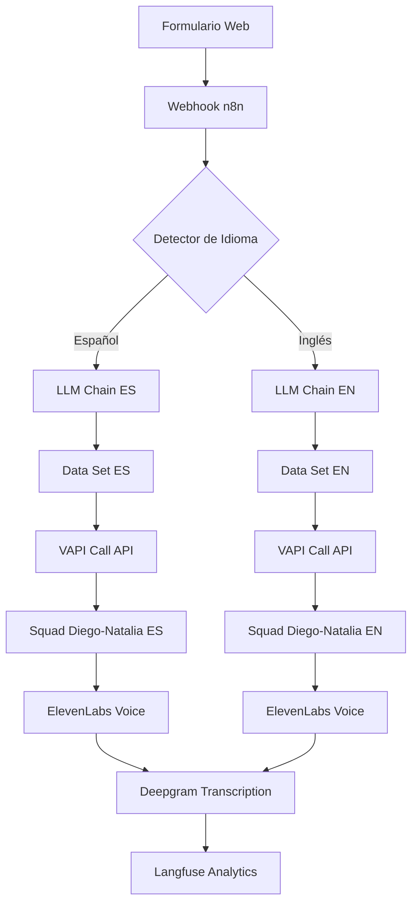

# DOCUMENTACIÓN TÉCNICA - SISTEMA CLEVER IDEAS + VAPI
## Workflow de n8n para Llamadas Automáticas con IA

---

## 📋 ÍNDICE

1. [Resumen Ejecutivo](#resumen-ejecutivo)
2. [Arquitectura del Sistema](#arquitectura-del-sistema)
3. [Flujo de Datos Completo](#flujo-de-datos-completo)
4. [Componentes Principales](#componentes-principales)
5. [Configuración de Agentes Virtuales](#configuración-de-agentes-virtuales)
6. [Integraciones y APIs](#integraciones-y-apis)
7. [Configuración de Voz y Audio](#configuración-de-voz-y-audio)
8. [Sistema de Monitoreo y Analytics](#sistema-de-monitoreo-y-analytics)
9. [Manual de Despliegue](#manual-de-despliegue)
10. [Mantenimiento y Troubleshooting](#mantenimiento-y-troubleshooting)

---

##  RESUMEN EJECUTIVO

### Propósito del Sistema
El sistema **CLEVER Agent-Web Call Outbound** es una solución automatizada de llamadas salientes que integra:
- **n8n** como orquestador de workflows
- **VAPI** como plataforma de llamadas con IA
- **OpenAI GPT-4** para procesamiento de lenguaje natural
- **ElevenLabs** para síntesis de voz
- **Deepgram** para transcripción de audio
- **Langfuse** para observabilidad y analytics

### Funcionalidad Principal
1. **Recepción de datos**: Webhook recibe información de formulario web
2. **Detección de idioma**: Sistema detecta idioma (español/inglés) automáticamente
3. **Enriquecimiento de datos**: IA investiga información de la empresa
4. **Llamada automática**: Sistema inicia llamada usando VAPI con agentes especializados
5. **Flujo conversacional**: Agentes virtuales (Diego/Natalia) manejan discovery y agendamiento
6. **Seguimiento**: Analytics y reportes completos de cada interacción

---

## 🏗 ARQUITECTURA DEL SISTEMA

### Diagrama de Arquitectura



### Componentes del Sistema

| Componente | Función | Tecnología |
|------------|---------|------------|
| **Webhook Receptor** | Recibe datos del formulario web | n8n Webhook |
| **Detector de Idioma** | Identifica idioma del prospecto | n8n Switch Node |
| **Investigador IA** | Enriquece datos de empresa | OpenAI GPT-4o |
| **Configurador de Datos** | Prepara payload para VAPI | n8n Set Node |
| **Iniciador de Llamadas** | Ejecuta llamadas automáticas | VAPI API |
| **Agentes Virtuales** | Maneja conversaciones | OpenAI + VAPI |
| **Síntesis de Voz** | Convierte texto a voz natural | ElevenLabs |
| **Transcripción** | Convierte voz a texto | Deepgram |
| **Analytics** | Monitoreo y reportes | Langfuse |

---

## 🔄 FLUJO DE DATOS COMPLETO

### 1. Recepción de Datos (Webhook)
```json
{
  "webhook_url": "https://workflows.cleverideas.com.mx/webhook/form-web",
  "method": "POST",
  "data_received": {
    "nombre": "string",
    "telefono": "string (10 digits)",
    "email": "string",
    "empresa": "string",
    "giro": "string",
    "dominio": "string",
    "idioma": "es|en"
  }
}
```

### 2. Detección de Idioma
```javascript
// Lógica de Switch Node
if ($json.body.idioma === "en") {
    // Ruta inglés
    return 0;
} else if ($json.body.idioma === "es") {
    // Ruta español
    return 1;
}
```

### 3. Enriquecimiento con IA
**Para Español:**
```javascript
const prompt = `
realiza una investigación en la web, de la empresa y su sitio web, 
asegurate de traer toda la información relevante. 
en menos de 100 palabras, entrega la respuesta en una sola linea de texto, 
sin saltos de linea, sin caracteres especiales, en texto plano.
Si el dominio es de un proveedor de correo popular, 
ignora la peticion y devuelve un: no se encontraron datos de la empresa.

página web: ${dominio}
nombre de la empresa: ${empresa}
Giro: ${giro}
`;
```

**Para Inglés:**
```javascript
const prompt = `
conduct research on the web about the company and its website 
make sure to gather all relevant information in less than 100 words 
deliver the answer in a single line of text without line breaks 
without special characters in plain text

webpage: ${dominio}
company: ${empresa}
sector: ${giro}
`;
```

### 4. Configuración de Datos por Idioma

#### Configuración Español
```javascript
{
  "phone_number_language": "6d8a5395-4aab-4546-9014-fb8cdc2a6512",
  "name": "{{ $json.body.nombre }}",
  "phone": "+52{{ $json.body.telefono }}",
  "company": "{{ $json.body.empresa }}",
  "sector": "{{ $json.body.giro }}",
  "email": "{{ $json.body.email.replace(/-/g, ' guion medio ')... }}",
  "domain": "{{ $json.body.dominio }}",
  "male_voice": "tomkxGQGz4b1kE0EM722",
  "female_voice": "tnbVzYo75ZlfRbC9qzM3",
  "date": "función de fecha CDMX",
  "first_message": "¡Hola {{ nombre }}! Soy Diego de Clever IDEAS...",
  "scrapping": "{{ $json.text }}"
}
```

#### Configuración Inglés
```javascript
{
  "phone_number_language": "6d8a5395-4aab-4546-9014-fb8cdc2a6512",
  "name": "{{ $json.body.nombre }}",
  "phone": "+1{{ $json.body.telefono }}",
  "company": "{{ $json.body.empresa }}",
  "sector": "{{ $json.body.giro }}",
  "email": "{{ $json.body.email }}",
  "domain": "{{ $json.body.dominio }}",
  "male_voice": "ChO6kqkVouUn0s7HMunx",
  "female_voice": "ys3XeJJA4ArWMhRpcX1D",
  "date": "función de fecha Nueva York",
  "first_message": "Hello {{ nombre }}! I am Diego from Clever IDEAS...",
  "scrapping": "{{ $json.text }}"
}
```

---

##  CONFIGURACIÓN DE AGENTES VIRTUALES

### Squad Structure
El sistema utiliza un **Squad** con dos agentes especializados:

```json
{
  "squad": {
    "name": "Squad Clever IDEAS - Discovery y Agendamiento",
    "members": [
      {
        "assistant": "Diego-Clever",
        "role": "Discovery y Generación de Interés",
        "transfer_to": "Natalia-Clever"
      },
      {
        "assistant": "Natalia-Clever", 
        "role": "Agendamiento de Demos",
        "transfer_to": null
      }
    ]
  }
}
```

### 🎭 AGENTE DIEGO - DISCOVERY SPECIALIST

#### Configuración del Modelo
```json
{
  "name": "Diego-Clever",
  "model": {
    "provider": "openai",
    "model": "gpt-4o",
    "temperature": 0.75, // Español: 0.75, Inglés: 0.80
    "fallbackModels": ["gpt-4-0125-preview", "gpt-3.5-turbo"]
  }
}
```

#### Herramientas Disponibles
1. **send_follow_up_info**
   - **Propósito**: Enviar información de seguimiento por email/SMS
   - **URL**: `https://workflows.cleverideas.com.mx/webhook/agent-web-tools`
   - **Parámetros**: prospect_name, company, email, phone, interest_areas, call_summary

2. **endCall**
   - **Propósito**: Finalizar llamada con mensaje personalizado
   - **Mensaje**: "Perfecto, {nombre}, nos vemos muy pronto en la demo..."

#### Personalidad y Comportamiento
- **Personalidad**: Profesional, cálido, entusiasta, consultivo
- **Enfoque**: Conversacional natural, evita interrogatorios directos
- **Especialidad**: Transformación digital y automatización con IA
- **Objetivo**: Discovery de necesidades → Despertar interés → Transferir a Natalia

#### Etapas del Proceso de Diego
1. **Apertura Cálida**: Saludo personalizado con datos del formulario
2. **Presentación Clever**: Contexto de la empresa y soluciones
3. **Discovery Conversacional**: Identificación de necesidades y dolores
4. **Storytelling**: Casos de éxito relevantes al sector
5. **Propuesta Técnica**: Tipos de agentes recomendados
6. **Generación de Interés**: Invitación a demo personalizada

#### Tipos de Agentes que Presenta Diego
1. **Gestión de Citas**: Automatiza programación y confirmación 24/7
2. **Ventas y Conversión**: Identifica oportunidades y califica leads
3. **Cobranza Inteligente**: Gestiona recordatorios y acuerdos de pago
4. **Servicio al Cliente**: Resuelve consultas frecuentes y escala casos complejos

###  AGENTE NATALIA - SCHEDULING SPECIALIST

#### Configuración del Modelo
```json
{
  "name": "Natalia-Clever",
  "model": {
    "provider": "openai",
    "model": "gpt-4o", // Español: gpt-4o, Inglés: gpt-4o
    "temperature": 0.7,
    "fallbackModels": ["gpt-4-0125-preview", "gpt-3.5-turbo"]
  }
}
```

#### Herramientas Disponibles
1. **schedule_demo_appointment**
   - **Propósito**: Agenda demo personalizada
   - **Parámetros**: prospect_name, company, prospect_email, prospect_phone, preferred_date, preferred_time, time_zone, additional_attendees, interest_areas, special_requirements

2. **validate_email_format**
   - **Propósito**: Validar formato de email
   - **Tipo**: Síncrono

3. **send_demo_confirmation**
   - **Propósito**: Enviar confirmación por email y SMS
   - **Mensaje**: "Perfecto, te voy a enviar toda la confirmación..."

4. **endCall**
   - **Propósito**: Finalizar llamada exitosa
   - **Mensaje**: "¡Perfecto! Ya tienes tu demo agendada..."

#### Personalidad y Comportamiento
- **Personalidad**: Organizada, amable, eficiente, detallista
- **Especialidad**: Coordinación de demos personalizadas
- **Restricciones**: Solo lunes a viernes, 9am-6pm, máximo 2 semanas adelante
- **Objetivo**: Recopilar información completa → Agendar demo → Confirmar

#### Proceso de Natalia
1. **Saludo Contextual**: Referencia la conversación con Diego
2. **Recopilación de Fecha/Horario**: Disponibilidad dentro de restricciones
3. **Validación de Email**: Confirmación y validación técnica
4. **Invitados Adicionales**: Tomadores de decisiones o equipo técnico
5. **Áreas de Interés**: Personalización de la demo
6. **Confirmación y Cierre**: Resumen completo y envío de confirmaciones

---

## 🔌 INTEGRACIONES Y APIs

### VAPI API Configuration
```json
{
  "endpoint": "https://api.vapi.ai/call/phone",
  "method": "POST",
  "headers": {
    "Authorization": "a6e56ec9-20e9-4b6f-aae1-8f5ec195879f",
    "Content-Type": "application/json"
  }
}
```

### OpenAI Integration
```json
{
  "provider": "openai",
  "model": "gpt-4o",
  "credentials": {
    "id": "SbpFTXSGHOKIB4GL",
    "name": "OpenAi account"
  },
  "options": {
    "maxTokens": 3500
  }
}
```

### Webhook Endpoints
1. **Formulario Web**: `https://workflows.cleverideas.com.mx/webhook/form-web`
2. **Agent Tools**: `https://workflows.cleverideas.com.mx/webhook/agent-web-tools`
3. **End Call**: `https://workflows.cleverideas.com.mx/webhook/web_agent_endcall`

---

## 🎵 CONFIGURACIÓN DE VOZ Y AUDIO

### ElevenLabs Voice Configuration

#### Voces Español
```json
{
  "male_voice": "tomkxGQGz4b1kE0EM722",
  "female_voice": "tnbVzYo75ZlfRbC9qzM3",
  "provider": "11labs",
  "model": "eleven_turbo_v2_5",
  "stability": 0.30, // Diego: 0.30, Natalia: 0.40
  "similarityBoost": 0.8, // Diego: 0.8, Natalia: 0.30
  "style": 0.1, // Diego: 0.1, Natalia: 0.80
  "speed": 1.05, // Diego: 1.05, Natalia: 1.00
  "useSpeakerBoost": true,
  "enableSsmlParsing": true
}
```

#### Voces Inglés
```json
{
  "male_voice": "ChO6kqkVouUn0s7HMunx",
  "female_voice": "ys3XeJJA4ArWMhRpcX1D",
  "provider": "11labs",
  "model": "eleven_turbo_v2_5",
  "stability": 0.35, // Diego: 0.35, Natalia: 0.40
  "similarityBoost": 0.50, // Diego: 0.50, Natalia: 0.30
  "style": 0.0, // Diego: 0.0, Natalia: 0.80
  "speed": 1.05, // Diego: 1.05, Natalia: 1.00
}
```

### Deepgram Transcription
```json
{
  "provider": "deepgram",
  "model": "nova-3",
  "language": "multi",
  "numerals": true,
  "smartFormat": true,
  "endpointing": 140, // Diego: 190, Natalia: 140
  "confidenceThreshold": 0.75,
  "keywords": [
    // Español
    "clever", "ideas", "inteligencia", "artificial", "automatizacion",
    "ucontact", "whatsapp", "business", "contact", "center", "omnicanal",
    "demo", "transformacion", "digital", "interesa", "quiero", "gustaria",
    // Inglés
    "artificial", "intelligence", "automation", "interested", "want"
  ]
}
```

### Audio Processing Settings
```json
{
  "backgroundSound": "office",
  "backgroundDenoisingEnabled": true,
  "recordingEnabled": true,
  "voicemailDetection": {
    "provider": "vapi"
  },
  "startSpeakingPlan": {
    "waitSeconds": 0.9, // Diego: 0.9, Natalia: 0.8
    "smartEndpointingEnabled": true
  },
  "stopSpeakingPlan": {
    "numWords": 2,
    "voiceSeconds": 0.3,
    "backoffSeconds": 1.2 // Diego: 1.2, Natalia: 1.0
  }
}
```

---

## 📊 SISTEMA DE MONITOREO Y ANALYTICS

### Langfuse Configuration
```json
{
  "observabilityPlan": {
    "provider": "langfuse",
    "tags": ["Clever IDEAS", "discovery", "alexandra"], // Diego
    "tags": ["Clever IDEAS", "scheduling", "natalia"], // Natalia
    "metadata": {}
  }
}
```

### Analytics Schema - Diego
```json
{
  "tipoLlamada": "Discovery inicial|Seguimiento|Reagendamiento|Cierre final",
  "datosProspecto": {
    "nombreCompleto": "string",
    "telefono": "string",
    "empresa": "string", 
    "giro": "string",
    "tamanoEmpresa": "Micro|Pequeña|Mediana|Gran empresa"
  },
  "necesidadesIdentificadas": {
    "canalesComunicacion": ["WhatsApp", "Teléfono", "Email"],
    "doloresPrincipales": ["Atención fuera de horario", "Volumen alto"],
    "procesosRepetitivos": "string"
  },
  "solucionesRecomendadas": {
    "tiposAgente": ["Gestión de Citas", "Ventas y Conversión"],
    "justificacion": "string"
  },
  "procesoVenta": {
    "checkpointAlcanzado": "Saludo|Presentación|Discovery|Storytelling|Propuesta|Demo|Transferencia",
    "casosExitoCompartidos": boolean,
    "beneficiosMencionados": ["array"]
  },
  "resultadoLlamada": {
    "estadoVenta": "Interesado - Demo agendada|Tibio|No interesado",
    "nivelInteresDetectado": "Muy bajo|Bajo|Medio|Alto|Muy alto",
    "probabilidadCierre": 0-100
  }
}
```

### Analytics Schema - Natalia
```json
{
  "tipoLlamada": "Agendamiento inicial|Reagendamiento|Confirmación",
  "detallesDemo": {
    "fechaAgendada": "YYYY-MM-DD",
    "horarioAgendado": "string",
    "zonaHoraria": "string",
    "duracionEstimada": "string"
  },
  "invitadosAdicionales": [
    {
      "nombre": "string",
      "email": "string", 
      "puesto": "string"
    }
  ],
  "areasInteres": ["Gestión de Citas", "Ventas y Conversión"],
  "procesoAgendamiento": {
    "checkpointAlcanzado": "Saludo|Fecha|Email|Invitados|Interés|Confirmación",
    "emailValidado": boolean,
    "fechaConfirmada": boolean
  },
  "resultadoLlamada": {
    "estadoAgendamiento": "Demo agendada exitosamente|Pendiente|Cancelada",
    "confirmacionEnviada": boolean
  }
}
```

### Call Settings
```json
{
  "maxDurationSeconds": 1800, // Diego: 1800, Natalia: 900
  "endCallFunctionEnabled": true,
  "endCallPhrases": [
    // Español
    "hasta luego", "bye", "adiós", "nos vemos", "que tengas buen día",
    // Inglés  
    "talk to you later", "goodbye", "see you later", "have a great day"
  ],
  "messagePlan": {
    "idleMessages": ["¿Sigues por ahí?", "¿Me escuchas bien?"],
    "idleMessageMaxSpokenCount": 2,
    "idleTimeoutSeconds": 15
  }
}
```

---

## 🚀 MANUAL DE DESPLIEGUE

### Prerrequisitos
1. **n8n Instance**: Servidor n8n configurado y funcionando
2. **VAPI Account**: API key y configuración de números telefónicos
3. **OpenAI Account**: API key con acceso a GPT-4o
4. **ElevenLabs Account**: API key y voces configuradas
5. **Deepgram Account**: API key para transcripción
6. **Langfuse Account**: Configuración para observabilidad

### Variables de Entorno
```bash
# OpenAI
OPENAI_API_KEY=sk-...

# ElevenLabs
ELEVENLABS_API_KEY=...

# VAPI
VAPI_API_KEY=a6e56ec9-20e9-4b6f-aae1-.........

# Deepgram
DEEPGRAM_API_KEY=...

# Langfuse
LANGFUSE_PUBLIC_KEY=...
LANGFUSE_SECRET_KEY=...
```

### Configuración de Números Telefónicos
```json
{
  "phoneNumbers": {
    "spanish": "6d8a5395-4aab-4546-9014-fb8cdc2a6512",
    "english": "6d8a5395-4aab-4546-9014-fb8cdc2a6512"
  }
}
```

### Pasos de Instalación

#### 1. Importar Workflow en n8n
```bash
# Importar el archivo JSON del workflow
curl -X POST "http://your-n8n-instance/api/v1/workflows/import" \
  -H "Content-Type: application/json" \
  -d @"CLEVER_Agent-Web_Call_Outbound.json"
```

#### 2. Configurar Credenciales
1. **OpenAI API**: Agregar credenciales en n8n
2. **VAPI**: Configurar API key en HTTP Request nodes
3. **ElevenLabs**: Verificar voice IDs en configuración
4. **Deepgram**: Configurar en transcriber settings

#### 3. Configurar Webhooks
```bash
# Webhook principal
https://workflows.cleverideas.com.mx/webhook/form-web

# Webhook de herramientas
https://workflows.cleverideas.com.mx/webhook/agent-web-tools

# Webhook end-of-call
https://workflows.cleverideas.com.mx/webhook/web_agent_endcall
```

#### 4. Activar Workflow
```javascript
// En n8n interface
workflow.active = true;
```

### Testing y Validación

#### Test de Webhook
```bash
curl -X POST "https://workflows.cleverideas.com.mx/webhook/form-web" \
  -H "Content-Type: application/json" \
  -d '{
    "nombre": "Test User",
    "telefono": "5551234567", 
    "email": "test@example.com",
    "empresa": "Test Company",
    "giro": "tecnologia",
    "dominio": "https://example.com",
    "idioma": "es"
  }'
```

#### Verificación de Componentes
1. **Webhook Response**: Status 200
2. **Language Detection**: Ruta correcta (es/en)
3. **AI Research**: Respuesta coherente de OpenAI
4. **VAPI Call**: Llamada iniciada exitosamente
5. **Voice Synthesis**: Audio claro y natural
6. **Transcription**: Texto preciso
7. **Analytics**: Datos en Langfuse

---

## 🔧 MANTENIMIENTO Y TROUBLESHOOTING

### Monitoreo Regular

#### Métricas Clave
1. **Success Rate**: % de llamadas exitosas
2. **Average Duration**: Duración promedio por agente
3. **Transfer Rate**: % de transferencias Diego → Natalia
4. **Demo Booking Rate**: % de demos agendadas
5. **Voice Quality**: Latencia y claridad de audio
6. **Transcription Accuracy**: Precisión de Deepgram

#### Logs Importantes
```bash
# n8n execution logs
tail -f /var/log/n8n/executions.log

# VAPI call logs
curl -X GET "https://api.vapi.ai/call" \
  -H "Authorization: Bearer $VAPI_API_KEY"

# Langfuse analytics
https://langfuse.com/project/your-project-id/traces
```

### Problemas Comunes

#### 1. Llamada No Se Inicia
**Síntomas**: Webhook OK pero no hay llamada
**Diagnóstico**:
```bash
# Verificar VAPI API key
curl -X GET "https://api.vapi.ai/account" \
  -H "Authorization: Bearer $VAPI_API_KEY"

# Verificar número telefónico
curl -X GET "https://api.vapi.ai/phone-number/6d8a5395-4aab-4546-9014-fb8cdc2a6512" \
  -H "Authorization: Bearer $VAPI_API_KEY"
```
**Solución**: Verificar API key y configuración de números

#### 2. Voz Robótica o Distorsionada  
**Síntomas**: Audio poco natural
**Diagnóstico**: Verificar configuración ElevenLabs
```json
{
  "stability": 0.30,
  "similarityBoost": 0.80,
  "style": 0.10,
  "speed": 1.05
}
```
**Solución**: Ajustar parámetros de voz

#### 3. Transcripción Incorrecta
**Síntomas**: Agente no entiende al cliente
**Diagnóstico**: Verificar configuración Deepgram
```json
{
  "confidenceThreshold": 0.75,
  "endpointing": 140,
  "language": "multi"
}
```
**Solución**: Ajustar threshold y keywords

#### 4. Agente Fuera de Contexto
**Síntomas**: Respuestas no relacionadas
**Diagnóstico**: Revisar system prompts
**Solución**: Ajustar temperatura del modelo y reforzar instrucciones

#### 5. No Hay Analytics
**Síntomas**: Sin datos en Langfuse
**Diagnóstico**: Verificar configuración observabilityPlan
**Solución**: Confirmar API keys y tags

### Actualizaciones y Mejoras

#### Versionado del Workflow
```json
{
  "version": "1.0.0",
  "changelog": {
    "1.0.0": "Versión inicial con agentes Diego y Natalia",
    "1.1.0": "Mejoras en detección de idioma",
    "1.2.0": "Optimización de prompts y analytics"
  }
}
```

#### Backup y Recuperación
```bash
# Backup del workflow
curl -X GET "http://your-n8n-instance/api/v1/workflows/tOK30nqcNH3MSSal" \
  > backup_workflow_$(date +%Y%m%d).json

# Backup de configuraciones
cp /root/.n8n/config.json backup_config_$(date +%Y%m%d).json
```

### Optimizaciones de Performance

#### 1. Reducir Latencia
- Usar modelos más rápidos para respuestas simples
- Optimizar prompts para respuestas concisas
- Implementar cache para información de empresas

#### 2. Mejorar Conversión
- A/B testing de diferentes voces
- Optimizar timing de transferencias
- Personalizar más el discovery según sector

---

##  CONTACTO Y SOPORTE

**Desarrollado por**: Darig Samuel Rosales Robledo
**Versión**: 1.0.0
**Fecha**: Agosto 2025
**Documentado por**: Arquitecto de Soluciones Empresariales con IA

Para soporte técnico:
- **Email**: darig.soporte@gmail.com
- **Webhook**: https://workflows.cleverideas.com.mx
- **Instancia n8n**: workflows.cleverideas.com.mx

---

